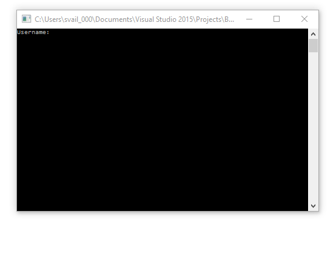

# Banking Simulator

Description:
This is a bank system simulation. A client can log in to open/close unlimited amounts of accounts and transact on it. A Manager can search any customer in the bank and have all the capabilities of a client plus the ability to open loans, set overdraft. A maintenance worker is capable of setting a flag to print a log of all the transactions.

Login information:
Customer: 
Username: joe
password: power

Manager
Username: super
password: power

Maintenance
Username: mechanic
password: power

